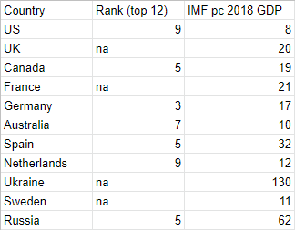

### What trends in porn can teach us about life today

We spend a lot of time watching Game Of Thrones and reading Harry Potter and
scrolling Facebook …  and watching porn (one hundred million people visit
pornhub.com a day). Yet while the first three are seen as apt objects of
cultural criticism, the latter isn’t. We read [economic analyses of Game Of
Thrones](https://www.theguardian.com/tv-and-radio/2015/apr/06/marxist-theory-game-of-thrones-lannisters-bankers-sex-power-feudal-westeros-revolution),
or about [the politics of Harry
Potter](https://www.reddit.com/r/LateStageCapitalism/comments/8rtxxg/how_harry_potter_reflects_the_liberalcentrist/),
or how [Foucaultian Facebook
is](https://philosophynow.org/issues/107/The_Heterotopia_of_Facebook), but we
seldom read about what tastes and trends in porn can teach us about economics or
politics or philosophy. This is a mistake: looking at trends in porn promises to
provide explanations in all these areas and more.

Of course, it’s understandable that people neglect porn: it’s embarrassing to
talk about and opinions vary about its morality. But if anything, these just
give us better reasons to talk about it. We are creatures of embarrassment and
shame (among other things), and if we overlook these features of our lives, our
perspective on what it’s like to be human will be warped. To understand politics
we need to understand both press releases and the wilds of 4chan; to understand
ourselves, we need to know both what we say on our well-crafted social media
profiles as well as what, under cover of Chrome’s incognito mode, we put into
porn sites’ search bar.

Similarly, any attempt to assess the morality of porn — whether your perspective
is anti- or pro- porn or just that it’s more complicated than that — needs to
have an accurate and up-to-date understanding of what porn is actually like. If
you think that treating porn dispassionately as a cultural object is too glib or
offensive, I can see where you’re coming from, but you need to know your enemy
(friend), and data can help.

And today that data is not so hard to come by. The porn tube site pornhub.com
has, for the past six years, been doing end-of-year reviews about trends in porn
in the preceding twelve months, including what’s popular and where, information
about peak times and usage volumes, and much else (the 2018 post is
[here](https://www.pornhub.com/insights/2018-year-in-review), and the others are
easily findable).

I will look at this data in the hope of providing answers to the following
questions that are both interesting and, I think, of existential significance
for how we live our lives and understand ourselves.

* the sex question: how does the porn we watch influence our real life sex lives,
or how does our real life sex lives influence the porn we watch?
* The economic (user) question: is the porn one consumes influenced by one’s
economic status?
* The economic (producer) question: is the porn one consumes influenced by the
economic status of the producers — are there porn monopolies, for example, that
get most of our attention?

Along the way we’ll discuss, and provide new perspectives on, questions such as
the supposed sex recession among young people today, the way in which the
economy influences our desires, and the status — and future — of porn as an
industry. I will begin with the first question.

(This post is more or less SFW; it contains some terms for types of porn, but no
media. That said, you might think about whether you want your boss looking over
you shoulder at it.)

**Porn As A Window On Our Private Selves**

Our lives are to a large extent *anti*-private today. It’s already a cliche that
google is the greatest mass surveillance instrument the world has ever known, a
fact you can be reminded of if you want, say, out of a mere formicological
curiosity, to learn about ‘ant colonies’ and are, before you’ve even finished
typing, met with the autocompletion (based on your past history):
‘antidepressants that don’t cause flatulence’. Google knows your secrets, and it
monetizes them.

Privacy is also undermined by social media. It’s also a cliche that young people
reveal anything and everything about themselves, but more subtly, if privacy is
keeping things for yourself, then one can argue that social media erodes it by
eroding the very self you want to keep private.

That sounds a bit fancy, but consider: saying something on social media is
saying something to hundreds of mostly strangers (and possibly thousands of even
more strange strangers if you go viral), in an environment where interpretative
charity isn’t exactly widespread. It encourages — indeed rewards — hiding your
thoughts, being obsequious to those with more clout  than you, biting your
tongue, and so on. That, I’m kind of tempted to think, has a tendency to tamp
down your real self, by compelling you not to express it.

So here’s a question: what are we, in the ever diminishing periods of privacy,
actually like? Looking at our porn searches promises to answer this question,
because consuming porn is fundamentally a private activity. We don’t broadcast
our tastes on social media — you probably know, or could guess at, most of your
online friends’ movie or book tastes, but would have no idea about their porn
preferences — and we even, as already mentioned, hide it from google by using
incognito browsing and clearing history. Porn is when we’re at our most alone
these days. So what are we like then?

*****

The answer provided by the pornhub.com data is both surprising and suggestive,
and sheds light on and corroborates the idea that there is a ‘sex recession’:
[that young people are having less sex that other
generations](https://www.theatlantic.com/magazine/archive/2018/12/the-sex-recession/573949/).
What the data show, I will argue, is that people are fleeing from real sex not
only in life, but also, and perhaps equally surprisingly, in their fantasy life.
Before taking a look at the data, ask yourself this question: what do you think
Pornhub’s most searched for terms were in 2018?

*****

Well, here’s the answer, showing the terms, and their ranking, as well as their
ranking for the previous five years:

(An important caveat: if you know anything about data science, you know more
than me, and there’ll be no regressions or chi squares here — I heartily
encourage those more able to do better (if the data allows it, which I doubt).)

Some of this graph isn’t too surprising. I take it that many of you might have
included ‘lesbian’ and ‘milf’, at least, on your list. And to the extent that
‘step mom’ is at least close to ‘milf’, it is also arguably not so surprising
(although see below).

But it is, I take it, very surprising to hear that ‘hentai’ was the second most
searched term online. In case you don’t know, hentai is animated porn, and
particularly, but not exclusively, Japanese animated porn. Some of them are
parodies, using characters from established anime, but there are also dedicated
pornographic series. For more information about hentai, check out the
[wiki](https://en.wikipedia.org/wiki/Hentai).

Not only is its mere presence interesting, but ‘hentai’ displays, among the top
five, the greatest shift in popularity. In 2013 it ranked a mere 22, while two
years later it was in number 2, and stayed there. There has been, the data tells
us, a rapid rise in the popularity of animated porn. What does this mean?

Here’s my interpretation. People who study these things have presented a lot of
data indicating that young people today are having sex less than their
predecessors (see the Atlantic article linked above for this). What this data
suggests is that *not only* are people not having sex in real life, but *even*
*their fantasy lives* they are moving away from realistic depictions of the sort
of sex they might possibly one day have.

The sex recession, I think, has invaded our minds and taken over. It’s not the
case, as you might have thought, that part of the reason people are not having
sex is because online porn now offers a more than adequate virtual replacement.
It’s not that porn now offers something that satisfies the same desires as real
life sex but without the awkwardness and vulnerability of being with others.
Instead, porn now offers something only roughly tethered to reality, a world of
sex with ‘demons’ or ‘beasts’ or … pokemon (these three examples taken from the
most viewed videos, of all time, in the hentai category). People find themselves
not wanting to engage with real life sex but still stuck with all-too-human
desires, and so they seek to satisfy them with media that are maximally divorced
from real life. That is my, admittedly very speculative, theory.

Let me respond to some objections, along the way presenting some more data.
Firstly, you might think that this says nothing about broad and general trends,
but is, perhaps, just a reflex of the fact that anime and hentai are long
established mediums in Japan (and perhaps other east Asian countries).

But more fine-grained data shows that’s not right. Hentai is popular everywhere.
The same (2018) survey tells us that it is the second most searched term in
Spain, third in Canada, fourth in Australia, fifth in the US, eighth in Germany,
and tenth in France, for example, as well as being first in Mexico and Brazil
and Russia.

In sum, there is no clear geographical pattern that could explain away the
popularity of hentai. It is popular all over the world (similarly, it’s worth
noting, the sex recession is also widespread).

Here’s another objection. I said people are fleeing sex in their fantasies as
well as reality. But that’s not really what the data shows. Arguably, it only
shows that people, *in addition to* actual, milfy lesbiany sex, are also looking
at animated sex. Nothing in the data, or indeed common sense, suggests that
these categories are exclusive, and that if you search for one you can’t search
for another.

I concede the point. But I don’t think it matters too much. These, surely, are
the facts: many, many more hours are spent watching animated sex than we would
expect. This is weird, calls for explanation, and an explanation is that people,
in so doing, are withdrawing, partially, from real sex. Even if they then go and
look at normal porn, it will still remain a fact that their sexual fantasy life
is more filled with unreal fantasies than we would have expected ex ante.

Not only that, but I think we can furnish other evidence in favour of a move
towards the unreal. Looking again at the graph above, you’ll note that ‘step
mom’ has increased in popularity markedly over the years. This is a fact even
more pronounced (and more disturbingly) for ‘step sister’:

‘Step sister’ moved to position 5 in 2017 from being in position 66 in 2013, a
huge move (it is not listed in the top 20 at all in 2018 (which I just
represented as an arbitrary lower number; see again my disclaimer about data
science), but I suspect they have stopped counting it. I asked pornhub.com if
this was so but they didn’t get back to me.) In the same vein, of the 32 videos
listed as most watched in the US this week, fully 12 of them contained some
family terms in their title. These videos are produced by big studios, and have
high production values and famous actors — they are completely mainstream. By
contrast, compare the ailing fortunes of what one would surely expect to be a
more traditionally popular category, ‘teen’, surely a paradigm of
close-to-real-life porn:

Is there anything that ‘incest’ and ‘hentai’ have in common? Well, here’s a
suggestion: they can’t be acted on. You can’t have sex with cartoons or your
family. People are putting themselves out of the sex game by filling their heads
with fantasies that they can’t act on, out of fear or distaste for eventually
having sex.

  So that’s claim one: the recent worldwide trend in animated porn (and
possibly incest porn) shed new light on the sex recession, indicating that it’s
not that porn has replaced sex, but that the same turning away from real sex
people have noted has infected our fantasy lives.

**The Economic Questions**

I’ve so far been concerned with our fantasies, deep and private and particular
aspects of ourselves. I want now to zoom out and see if the Pornhub data can
tell us anything instructive about how our fantasies are formed by social or
economic factors. The answers are interesting.

The first question is whether our pornographic tastes vary depending on our
economic situation. Think about it yourself for a second — do you think they do?
Do poor people and rich people like different things?

I thought it was possible. For example, consider the following line of
reasoning. We like porn that features people like us (this is born out by the
data — for most countries, one of the most searched terms is that country, or
rather the adjective for that country). Moreover, it makes sense (and is again
born out by things I’ve read) that performers earn more money for doing more
extreme things — more for hardcore than for solo, and more as one does more
extreme sorts of acts. A porn producer, then, who wants to film extreme acts,
might find themselves unable to afford the rates of performers from rich
countries, and accordingly going to poorer countries to film where those acts go
cheaper.

The hypothesis might be suggested then that people belonging to poorer countries
prefer watching more extreme porn, because they prefer to watch people like
them, and people like them disproportionately star in extreme porn. In this way,
one’s sexual tastes would be determined by broad macroeconomic facts, a
depressing possibility.

(Let me make it explicit that I in no way endorse or think that — if the above
story were true — it would be good, as some libertarians might. I don’t, I think
it’s gross and exploitative.)

As against that, one might think that economic factors have no — or at least a
different — economic role to play. One often hears that, say, German pornography
is especially perverse, but Germany is a prosperous country, and one hears the
same about Japan, but at least taking the longer view Japan has underwent many
economic vicissitudes. As far as I can tell, the porn industry in Japan has been
going strong since at least the 80s when Japan was thought to be the next
world-leading economy. So which is it — is the porn we watch determined by
economics, or nah?

I think the data suggests nah, although more research is needed. I looked at the
varying popularity of ‘anal’, taking it i) as an exemplar and proxy for a more
extreme sex act but also ii) one that is sufficiently popularized to be likely
to appear in most searched lists. Here is what I found (for individual
countries, Pornhub tells us the twelve most popular terms for that year; na
below means it’s not on the list):

  

We have the ranking for ‘anal’ in the left column and the IMF’s ranking of
countries by per capita GDP (culled from
[here](https://en.wikipedia.org/wiki/List_of_countries_by_GDP_(nominal)_per_capita))
in the right, and while this isn’t an amazing comparison (many more countries
are in the GDP rankings than the porn ones, for one) I think it’s probably
already enough to see that there’s no clear patter in the data.

Although it would be foolhardy to draw too much from this one example, at least
at first glance it seems that pornographic tastes might float free from one’s
economic situation. (Further weak support for this is that ‘gangbang’, again an
extreme sort of act, is represented in few countries’ top ten lists, but is in
both Sweden’s and Germany’s, which are two of the strongest economies on the
list.)

**The Uber of Porn**

The second economic question I was curious about was whether there were a number
of monopolizing pornography companies that receive a disproportionate amount of
attention. For this, I had to go beyond the Pornhub data, and, owing to the lack
of any neat way to collect lots of data, the following has, perforce, to be
somewhat impressionistic. If I continue to think and write about this, I will
attempt to find easy to collect data that can help shed light on this question
(suggestions very welcome!)

So, another question for you, reader: Pornhub offers a ‘popular in X country
over the last time period’ search option which you can ask to list the most
watched videos over the last week/year/all time. We can then ask: is there some
pornography producer or website that predominates? 

Here’s a closely related question. Money buys most of the things we’re
interested in. As one would expect, there’s a [positive
correlation](http://www.ser.tcu.edu/2005/SER2005%20Terry%20Butler%20DeArmond%20137-148.pdf)
between budget and box office success for movies, and, even more grimly, people
have argued that, typically, [the amount spend on the campaign predicts the
president](https://fivethirtyeight.com/features/money-and-elections-a-complicated-love-story/).

This of course has significance for how we live our lives — there is no reason
to think that the best movies are the most expensive, nor the best candidates
the richest. Accordingly, if pornography were the same, so that what was watched
was a function of how much money was thrown behind it, we might be faced with
the grim conclusion that our very desire is up for sale. So: is that so?

In order to answer this question, I looked at the videos which were most popular
this week in the US.

There were 32 videos on the front page, and I — lazily — looked at only 20
(eyeballing the rest revealed a similar pattern). 6 were from amateurs who are
registered with Pornhub and who receive some of the ad revenue (more on this
below). 11 were from studios and were uploaded by the studios. 2 were from
studios but uploaded by non-studios, and 1, while professional, wasn’t from a
recognizable studio and were uploaded by users.

Doing unscientific tallies like this seemed to show that this sort of
distribution was pretty common: most popular videos are either by studios and
uploaded by studios, or by registered amateurs who are in a business
relationship with Pornhub. By contrast, and again with the caveat that we’re
talking about most watched videos, both genuine amateur (uploaded by someone not
registered with Pornhub) and pirated professional (uploaded by someone who
doesn’t have the right to distribute the file) were rare. 

The data here are inconclusive, but I have included this section for a reason.
Almost all the popular videos are either by professional companies, or by
verified amateurs. Although that partly seems to disprove the thought that it’s
purely money that buys success, it does suggest another one: that it’s Pornhub
which is the economic determinant of what we watch. Their search engines
prioritize — I hypothesize — legitimate content, content uploaded by the content
owners. When you search for something, you’re not necessarily getting the video
what will best satisfy your desire, but the non-copyright-infringing video that
will satisfy your desire.

Of course, that’s not necessarily a bad thing: if you are pro-porn, you should
be happy that money is going to its creators. But it has a very important
consequence.

Going into this, I assumed that pornhub.com was a quasi-legal instrument of
piracy, a tube site like the sort on which you can download recent television.
It’s not. I think the best way to think of it is that Pornhub is essentially
trying to Uber-ize porn. Pornhub itself doesn’t produce porn, it doesn’t pay
actors, but instead offers them a means to promote their services, just as Uber
don’t employ drivers or maintain cars, but gives drivers a way to sell rides.
Pornhub is a platform business, like Uber, Airbnb, even social media sites, the
crucial feature of which is that it relies on others for content and provides
for them merely a place to get their content seen.

Realizing this, we make predictions about the future of pornography and, thus,
to some extent, the future of desire. Just as Uber’s eventual end game is to get
rid of cabs, and then get rid of drivers, so Pornhub’s eventual goal, surely,
must be to wait until they’ve got as much free and user-generated content as
they can until they become a more attractive proposition than any studio. No one
will subscribe to websites or buy DVDs because they can get everything from
pornhub.com. Studios and producers will go out of business, and then any
aspiring porn stars will have no other option than to produce porn themselves,
bearing all the costs of production and promotion, and put it on Pornhub, all
the while paying Pornhub for the platform. And Pornhub will develop a monopoly
on pornography, enabling them to give their content creators worse deals. 

The pornographic future, then consists of amateurs (like Uber drivers) compelled
to use the dominant platform. They will — just like Airbnb hosts offer more
options than hotels — offer more options to viewers. But they will increasingly
be caught in a race to the bottom, as lower barriers to entry will lead to more
people trying to sell pornography, and that increased supply will lead to lower
earnings for the producers, and the corresponding necessity of performing more
niche (thus probably extreme) sex acts to make money.

Porn might seem much closer to TV or movies than to services like accommodation
or transport. If I’m right, this is not so, and this fact will become apparent
in the next few years.

*****

  About a hundred and twenty years ago Freud published *The Interpretation of
Dreams*, offering a way to understand ourselves that looked beyond what we
publically said and concentrated on our quiet and private and strange moments,
most notably dreams. And what he found, famously, was sex. He would later use
these theories to try to analyse life and art in general, and was followed by
many who did the same in philosophy, literary studies, and beyond.

That movement is kind of moribund, the occasional hirsute Slovenian
notwithstanding. What I’ve suggested here, though, is that something like it
should be resuscitated and upgraded for the 21st century. We don’t need to
knotty complexities of psychoanalysis to see what people want, we can just see
what they search for. And what they search for, if you buy the arguments of this
article, has much to teach us about desire and its industry today and tomorrow.
